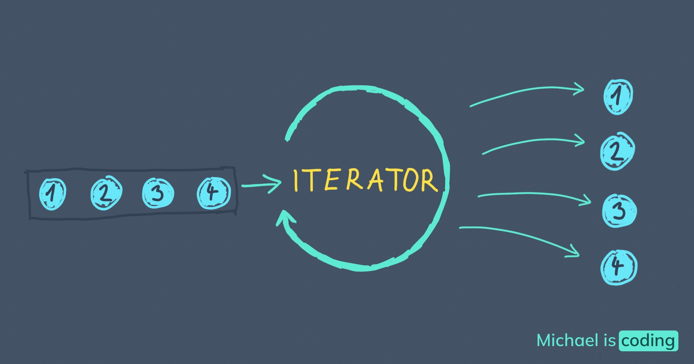

### Author : Idrissa SYLLA

## Iterators and Generators

##### Introduction 
In telecommunications, the management and processing of real-time data streams is essential. Iterators and generators are fundamental concepts in programming that can help to process large volumes of data efficiently. In this article, we will explore iterators and generators, explaining how they work, their benefits, good practices for using them, and providing practical examples of their use in general and in telecommunications.

#### Iterators and generators
Iterators and generators are key concepts in programming, particularly in functional programming and Python.
Conceptual Overview Iterators and generators are key elements of functional programming. Iterators are objects that produce a collection of elements one by one, while generators are special functions that return an iterator. Iterators can be created from any collection of data, such as a list, dictionary or set, while generators can be used to create infinite sequences or data on demand.
Iterators and generators work using special methods and concepts from functional programming. Iterators use the special methods `__iter__()` and `__next__()` to traverse a collection of elements one by one, and to signal when the end of the collection has been reached. Generators use the `yield` keyword to return values to the caller, while suspending execution of the function to allow further execution.

##### Iterators 

An iterator is an object that allows you to traverse a collection of elements one by one, providing a method to access each element in the collection. Collections in Python such as lists, sets, tuples, dictionaries and even strings can behave like iterators. Iterators are used to process data sequentially and are widely used in loops, data processing functions and used for example in an expression.
 
```python
my_list = ["Apple", "Pear", "Orange"]
for e in my_list:
    print(e)
```


It is possible for any object to behave like an iterator. To do this, it only needs to implement the special __iter__() and __next__() methods.
__iter__() : Returns an object that serves as an iterator. An iterator must itself have a __iter__() method, which may be limited to returning the iterator itself.
__next__() :Returns the next element. If there are no more elements, then this method must raise an exception of type StopIteration.
Below is an example of an iterator that counts to 10:

```python
class Counter:

    def __init__(self):
        self.number = 0

    def __iter__(self):
        return self

    def __next__(self):
        self.number += 1
        if self.number > 10:
            raise StopIteration
        return self.number
```


It is possible to use the Counter class in a for expression:

```python
for i in Counter():
    print(i)

>>> Displays numbers from 1 to 10.
```


### The iter() and next() functions
The `iter()` function takes as input an iterable object (a list, tuple, dictionary, etc.) and returns an iterator for that object. The iterator is an object that allows you to go through the elements of the iterable object one by one, using the ` next()` function. The ` next()` function takes an iterator as input and returns the next element of the iterable object. Each time the next()function is called, the iterator advances to the next element of the iterable object and returns that element. If all elements of the iterable object have been traversed, the function `next()` raises a StopIteration exception.

Here is a concrete example to help you understand how to use these functions. Let's say we have a list of numbers and we want to display them one by one using an iterator and the function `next()`:

```python
my_list = [1, 2, 3, 4, ]
my_iterator = iter(my_list)

print(next(my_iterator)) # Display 1
print(next(my_iterator)) # Display 2
print(next(my_iterator)) # Display 3
print(next(my_iterator)) # Display 4
print(next(my_iterator)) # Raises the StopIteration exception
```

```
>>> 1
>>> 2
>>> 3
>>> 4
```
In summary

In this example, we first create an iterator for the list my_list using the `iter()` function. Then we use the `next()` function to access each element of the list one by one. When we reach the end of the list, the `next()` function throws the `StopIteration` exception.

The `iter()` and `next()` functions are therefore very useful for browsing iterable objects one element at a time, using an iterator to access each element sequentially.


```python
class Path:
    def __init__(self):
        self.direction = []

    def left(self):
        self.direction.append("left")

    def right(self):
        self.direction.append("right")

    def __iter__(self):
        return iter(self.direction)


path = Path()
path.right()
path.left()
path.left()
path.right()

for direction in chemin:
    print(direction)
```


```
>>> Poster
>>> right
>>> left
>>> left
>>> right
```


### Generators
Generators are a special category of iterators. A generator creates the next element in the sequence on demand. To do this, the generator can use a mathematical formula to calculate a sequence or it can use an external system such as a database to extract the next element. The advantage of a generator is that it is not necessary to construct the complete list of elements in the sequence in memory. Generators therefore have a very small memory footprint which allows optimised programs to be written. The most commonly used generator in Python is created via the `range` class:
We have already presented an example of a generator above with the example of the class `Counter` which is in fact a very simplified implementation of `range` :

```python
class Counter:

    def __init__(self):
        self.number = 0

    def __iter__(self):
        return self

    def __next__(self):
        self.number += 1
        if self.number > 10:
            raise StopIteration
        return self.number
```


The `Counter` class stores only the `number` attribute, i.e. the current value. This allows it to infer the next value and update this attribute each time `__next(self)__ ` is called.
It is therefore possible to create generators using the iterator implementation principle. However, Python provides two other ways of creating generators which are much simpler and therefore much more useful in programs.
### Generating functions with yield`
Generator functions with `yield` sare a common way of using generators in Python. A generator function is a function that uses the yield statement to produce successive values in an iterator. When a generator function is called, it does not immediately return a value like a normal function, but rather a generator object that can be used to obtain the values produced by the yield statement.
Here is an example of a generating function that produces a sequence of random numbers:

```python
import random

def random_numbers(count):
    for i in range(count):
        yield random.randint(1, 100)
```


This function takes as input a coun number and produces count random numbers on each call. The for loop in the function is used to produce each value using the yield statement. When the function is called, it returns a generator object that can be used to run through the sequence of random numbers:

```
>>> numbers = random_numbers(5)
>>> next(numbers)
10
>>> next(numbers)
84
>>> next(numbers)
26
>>> next(numbers)
32
>>> next(numbers)
4
>>> next(numbers)
Traceback (most recent call last):
  File "<stdin>", line 1, in <module>
StopIteration
```


In this example, we call random_numbers(5) to produce a sequence of 5 random numbers. We store the generated generator object in the numbers variable. We then use the next()function to get each successive random number, until all numbers have been generated and the iterator throws the StopIteration exception.
Yield generating functions are useful in many contexts, including the processing of real-time data streams in telecommunications. They allow data to be generated efficiently and sequentially, minimising memory requirements and allowing asynchronous processing

The yield froma syntax was delivered in Python 3.3 to simplify the writing of generating functions. This syntax avoids writing multiple nested loops to iterate over multiple iterables.
Here is an example to illustrate the use of yield from:

```python
def generator_nested_list(nested_list):
    for sublist in nested_list:
        yield from sublist
```

        

In this example, the generator function generateur_nested_list takes a list of lists as a parameter. The loop foriters over each sub-list and uses the yield fromp syntax to iterate over the elements of each sub-list. This generator function then returns each element one by one.
###functions `enumerate`, `map`, `zip`, `filter`
The enumerate(), map(), zip()and filter()functions are built-in functions in Python that allow you to manipulate iterables such as lists, tuples, sets and dictionaries.
The enumerate()function returns a mandatory object containing (index, element) pairs for each element in the provided iterator. This allows you to browse a list or tuple while keeping track of the index of the element being processed. Here is an example:
 
```python
my_list = ['a', 'b', 'c', 'd']
for index, value in enumerate(my_list):
    print(index, value)
```


This will display :

```
>>> 0 a
>>> 1 b
>>> 2 c
>>> 3 d
```


The map()function applies a function to each element of an iterable and returns a list of the results. For example, to apply the square function to each element of a list, you can use the map()function as follows:

```python
def square(x):
    return x**2

my_list = [1, 2, 3, 4, 5]
squared_list = list(map(square, my_list))
print(squared_list)
```

This will display :

```python
[1, 4, 9, 16, 25]
```


The zip()function takes two or more iterables and groups them into tuples containing one element of each iterable. It stops when one of the iterables is exhausted. Here is an example:

```python
my_list1 = [1, 2, 3]
my_list2 = ['a', 'b', 'c']
my_list3 = ['x', 'y', 'z']
zipped_list = list(zip(my_list1, my_list2, my_list3))
print(zipped_list)
```


This will display :

```python
[(1, 'a', 'x'), (2, 'b', 'y'), (3, 'c', 'z')]
```


The filter()function applies a boolean function to each element of an iterable and returns only those elements for which the function is returned True. For example, to filter a list to keep only elements greater than 5, you can use the filter()function in this way:

```python
def greater_than_5(x):
    return x > 5

my_list = [1, 6, 3, 8, 2, 7, 9]
filtered_list = list(filter(greater_than_5, my_list))
print(filtered_list)
```


This will display :

[6, 8, 7, 9]


### In the field of telecommunications
####Example 1
Data analysis is a common task in computer science, especially in the telecommunications field. To efficiently process and manipulate large data sets, iterators and generators are very useful tools in Python. In this section, we will explore how to combine these two concepts to create efficient code using a concrete example.
Suppose we have a list of telecom data representing the calls made by a subscriber during a day, with the following information for each call: call duration in seconds, caller's number, call duration and date. We want to use iterators and generators to extract interesting information from this list of data.
Let's start by creating a list of dummy data:

```python
calls = [
    { 'first_name': 'Patrick', 'last_name': ' Nsukami', 'phone_number': '771230000', 'duration': 20, 'date': '2023-03-08'},
    { 'first_name': 'Idy', 'last_name': 'SYLLA', 'phone_number': '771230100', 'duration': 45, 'date': '2023-03-07'},
    { 'first_name': 'Doudou', 'last_name': 'Djémé', 'phone_number': '771230201', 'duration': 60, 'date': '2023-03-06'},
    { 'first_name': 'Marie', 'last_name': 'Niang', 'phone_number': '771231212', 'duration': 90, 'date': '2023-03-05'},
    { 'first_name': 'Elena', 'last_name': 'Sall', 'phone_number': '771230007', 'duration': 120, 'date': '2023-03-04'}
]
```

Now, let's use a generator function to iterate over long calls, i.e. those lasting more than 60 seconds:

```python
def long_calls(calls):
    for call in calls:
        if call['duration'] > 60:
            yield call

long_calls_iterator = long_calls(calls)
```
  

This function uses the yield control structure to return every call that lasted longer than 1 minute (60s). By using this yield function with our data list, we can obtain a list of long calls:


```python
long_calls_list = list(long_calls(telecom_data))
print(long_calls_list)
#Ensuite, utilisons une autre fonction génératrice pour itérer sur les appels par date :
def calls_by_date(calls):
    calls_by_date = {}
    for call in calls:
        if call['date'] not in calls_by_date:
            calls_by_date[call['date']] = []
        calls_by_date[call['date']].append(call)
    for date in sorted(calls_by_date.keys()):
        yield calls_by_date[date]

calls_by_date_iterator = calls_by_date(calls)
```


Now let's combine these two generating functions using the zip function to get a list of long calls by date:

```python
long_calls_by_date = zip(calls_by_date_iterator, long_calls_iterator)
```


Let's use the generator function to calculate the cumulative duration of long calls by date:


```python
def cumulative_duration(long_calls_by_date):
    for long_calls, calls_by_date in long_calls_by_date:
        cumulative_duration = sum(call['duration'] for call in long_calls)
        yield { 'date': calls_by_date[0]['date'], 'cumulative_duration': cumulative_duration}

cumulative_duration_iterator = cumulative_duration(long_calls_by_date)
```


This function also uses the yield control structure to return the cumulative sum of the call times so far. By using this generator function with our data list, we can obtain a list of cumulative durations:


Next, we will create another generator function that will take our list of data as input and return an iteration of tuples of the form (calling number, duration) for all calls that took place during the week of mars 4, 2022.
Here is the code for the second generating function:

```python
def calls_week(data):
    for item in data:
        if item['date'] >= datetime.date(2022, 3, 4) and item['date'] < datetime.date(2022, 3, 8):
            yield (item['caller_number'], item['duration'])
```

####Example 2

To process real-time data streams from a telecommunications base station with a mobile, we can use an iterator-based approach using a suitable programming language such as Python.
Here are the steps to follow:
1.	Generating real-time data using a generator: We can use the Python library `random` to create random values to simulate real-time data.
2.	Create an iterator to process the data one by one: You can use Python's `for` loop to iterate over each piece of generated data in real time. For example, if you store the generated data in a list, you can use a "for" loop to iterate over each item in the list.
3.	Analyse the data in real time: We can use Python's data processing functions to analyse the data in real time. For example, if you want to calculate the average of the data generated so far, you can use the `mean` function of the `numpy` library.
Example of Python code to process data in real time using a generator and an iterator:

```python
import random
import statistics

# Define a generator function to create random data in real time
def generate_data():
    while True:
        # Simulate the reception of data in real time
        data = random.randint(0, 100)
        yield data

# Define an iterator function to process data in real time
def process_data(data_stream):
    for data in data_stream:
        # Perform processing operations on the data received
        data_list = []
        data_list.append(data)
        data_mean = statistics.mean(data_list)
        data_median = statistics.median(data_list)
        filtered_data = filter(lambda x: x > 50, data_list)
        print("Mean:", data_mean)
        print("Median:", data_median)
        print("Filtered data:", list(filtered_data))

# Create a generator object to simulate the data in real time
data_generator = generate_data()

# Pass the generator object to the iterator function to process the data in real time
process_data(data_generator)
```
##### Real-time results.
```
>>> Mean: 48
>>> Median: 48
>>> Filtered data: []
>>> Mean: 58
>>> Median: 58
>>> Filtered data: [58]
>>> Mean: 65
>>> Median: 65
>>> Filtered data: [65]
>>> Mean: 79
>>> Median: 79
>>> Filtered data: [79]
>>> Mean: 27
>>> Median: 27
>>> Filtered data: []
>>> Mean: 92
>>> Median: 92
>>> Filtered data: [92]
>>> Mean: 35
>>> Median: 35
>>> Filtered data: []
>>> Mean: 39
>>> Median: 39
....
...
..
.

```


In this code, the generate_data() function creates an infinite sequence of random data using the yield function, thus generating data in real time.
The function `process_data(data_stream)` then takes this sequence of data as input to a data_stream generator object and uses a for loop to iterate over each element of the data sequence in real time. At each iteration, the function performs processing operations on the data, such as calculating the mean and median, filtering the data, etc.
Using functions such as `yield`, `mean`, `median`, `filter`, `__iter__()`, and `__next__()`, this code demonstrates how to process real-time data streams from a mobile telecommunications base station using generators and iterators in Python.
### Example 3 
A database can be used to store and analyze various types of data, such as customer information, call records, network performance metrics, and billing data. To analyze this data, iterators and generators can be used to efficiently process large amounts of information.

For example, suppose we have a database containing call records for a telecommunications company. Each call record contains information such as the caller's phone number, the callee's phone number, the call start and end times, and the duration of the call. To calculate the total duration of all calls made by a particular customer, we can use an iterator to iterate over all the call records in the database and a generator to filter out the records that correspond to the desired customer.

Here's an example code snippet in Python:
```python
import sqlite3

# Connect to the database
conn = sqlite3.connect('calls_data.db')

# Create an iterator to fetch all call records from the database
cursor = conn.cursor()
cursor.execute('SELECT * FROM call_records')
call_records = cursor.fetchall()

# Define a generator to filter out call records for a specific customer
def filter_customer(records, customer_phone):
    for record in records:
        if record[0] == customer_phone or record[1] == customer_phone:
            yield record

# Use the filter_customer generator to calculate the total call duration for a specific customer
total_duration = 0
for record in filter_customer(call_records, '555-1234'):
    total_duration += record[3]

print('Total call duration for customer 555-1234:', total_duration)

# Close the database connection
conn.close()
```
In this example, we use the `fetchall()` method to fetch all call records from the database and store them in a list. We then define a filter_customer generator that yields only the call records for the specified customer. Finally, we use a for loop to iterate over the filtered call records and calculate the total duration of all calls made by the customer. By using a generator to filter out only the relevant call records, we can avoid iterating over unnecessary data and improve the efficiency of our analysis.
### Exemple 4
Antennas are used to transmit and receive signals between cellular devices and base stations. Antenna cells are a set of cells that are covered by a specific antenna. By analyzing the traffic of each antenna cell, we can identify which cells are experiencing heavy traffic and which ones are not.

To do this, we can use iterators and generators in Python. An iterator is an object that can be iterated upon, meaning that we can loop through its elements. A generator is a special type of iterator that allows us to generate a sequence of values on-the-fly, rather than storing them all in memory at once.

Here is an example of how we can use iterators and generators to analyze traffic in antenna cells:

```python
# Define a list of antenna cells
antenna_cells = [1, 2, 3, 4, 5]

# Define a dictionary to store traffic data for each cell
traffic_data = {}

# Define a generator function to simulate traffic data for each cell
def generate_traffic_data():
    for cell in antenna_cells:
        # Generate random traffic data for each cell
        traffic = random.randint(0, 100)
        yield (cell, traffic)

# Iterate through the generator and store the data in the dictionary
for cell, traffic in generate_traffic_data():
    traffic_data[cell] = traffic

# Print the traffic data for each cell
for cell, traffic in traffic_data.items():
    if traffic > 50:
        print(f"Cell {cell} has heavy traffic ({traffic}%)")
    else:
        print(f"Cell {cell} has light traffic ({traffic}%)")
```


In this example, we first define a list of antenna cells and a dictionary to store traffic data for each cell. We then define a generator function `called generate_traffic_data()` that loops through each cell in the `antenna_cells` list and generates random traffic data for each cell. We use the `yield` keyword to return the data for each cell one at a time.

Next, we iterate through the generator using a `for` loop and store the data in the `traffic_data` dictionary. Finally, we loop through the dictionary and print out the traffic data for each cell. If the traffic for a cell is greater than 50%, we print a message indicating that the cell has heavy traffic, otherwise we print a message indicating that the cell has light traffic.

Using this approach, we can quickly analyze traffic data for multiple antenna cells and identify which cells are experiencing heavy traffic and which ones are not.

### Conclusion

Iterators and generators are important tools in the telecommunications domain for processing real-time data streams. They allow for continuous, real-time processing of data while performing real-time computation and analysis.
In the telecom domain, real-time data can come from different sources such as network devices, IoT sensors or transaction data. Iterators and generators provide flexibility and efficiency by allowing this data to be processed dynamically, without having to store the data in a complete data structure.


#### Références
https://docs.python.org/fr/3/howto/functional.html


https://www.analyticsvidhya.com/blog/2021/07/python-generators-and-iterators-in-2-minutes-for-data-science-beginners/

Documentation Python

